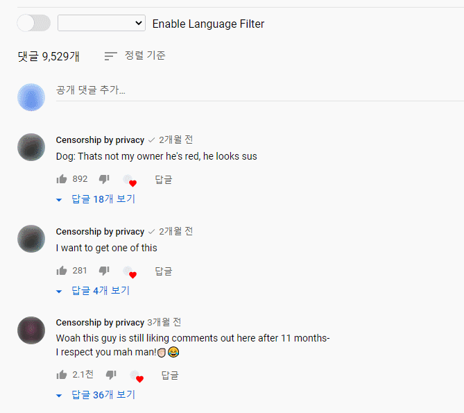

# YTCF

  

YouTube Comments Language Filter

[](https://chrome.google.com/webstore/detail/youtube-comment-language/jdiikkhlhlgndjllhoinidnkbgkjfepe) [](https://store.whale.naver.com/detail/iphmcbbipommlpkmgffhohlkomhakcel)

## What this is



## How to install

[How to Install Extensions From Outside the Chrome Web Store](https://www.howtogeek.com/120743/how-to-install-extensions-from-outside-the-chrome-web-store/)

## Build

First, it needs `npm` packages. thus you'd like to install them.

```
npm install
```

In `main` branch, it does not need to build scripts. But if you want for some reason (e.g. to convert ES6), you can build project with following command:

```
npm run build
```

After build, you can find scripts at `js/build` directory.

## Lint

also you can improve your code with lint checks as following command:

```
npm run lint
```

It will format the codes and show warnings and errors.
